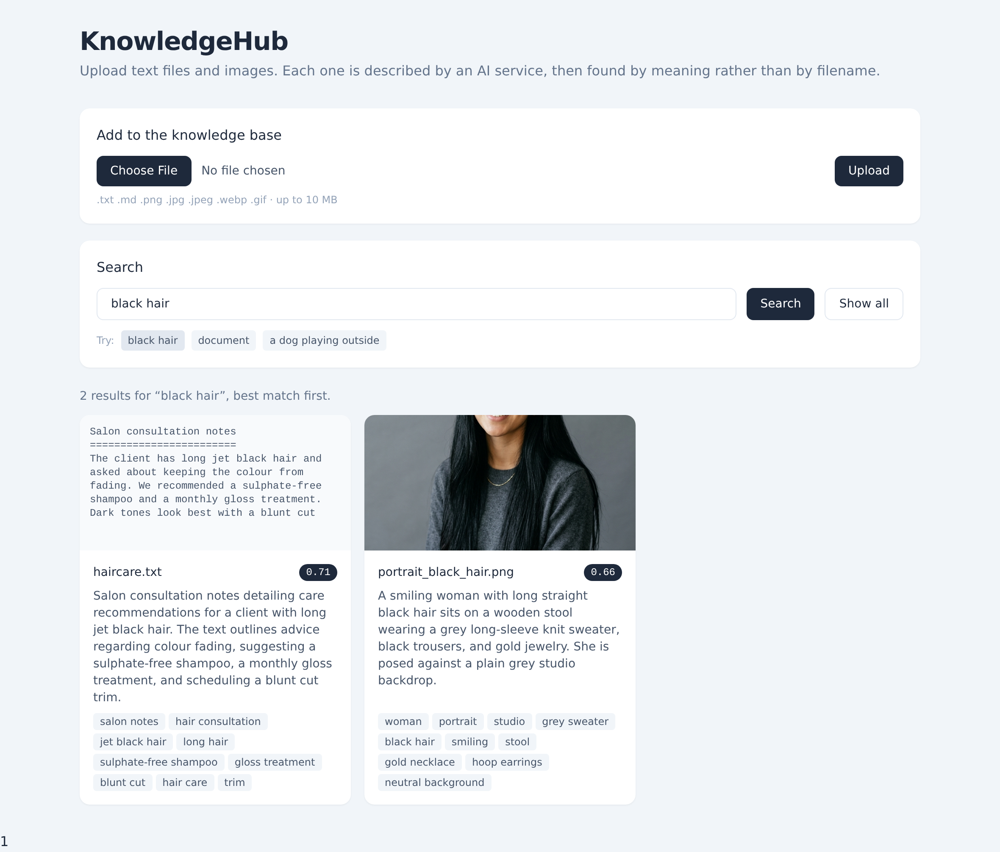

# KnowledgeHub

A small knowledge management system. Upload text files and images, and an AI
service writes searchable metadata for each one. Search then works by meaning:
`black hair` finds a photo of someone with black hair *and* a text file that
talks about it, even though neither contains that phrase in its filename.



**Live demo:** _add the Render URL here after deploying_
**Repository:** https://github.com/moti-gabay/KnowledgeHub

---

## How it works

```
Browser (static HTML + vanilla JS + Tailwind)
   |  multipart upload  /  GET /api/search?q=
   v
FastAPI (one process, one container)
   |
   +-- services/ingest.py ---> storage.py     write bytes to DATA_DIR/uploads/
   |                      +--> ai.py          Gemini: describe + tag, then embed
   |                      +--> vectorstore.py Chroma: upsert vector by asset id
   |
   +-- SQLite (SQLAlchemy)   source of truth for asset records
   +-- Chroma (persistent)   derived index, rebuildable from SQLite
```

Two stores with clearly separate jobs. SQLite owns the asset records. Chroma
holds one vector per asset and is only ever asked "which ids look like this
query". Results are joined back to SQLite by id.

### Upload

1. Validate the extension and size, then write the file under a UUID name.
2. Ask Gemini for a description and tags. Images are sent as bytes, text files
   as a truncated string, but both use the same call and the same response
   schema.
3. Embed `description + tags` (plus a text excerpt for text files).
4. Insert the row in SQLite, then upsert the vector into Chroma.

If Gemini fails, the upload still succeeds. The row is flagged `metadata_ok =
false`, the UI says so, and the asset simply is not searchable yet. A failing
AI service must never cost a user their file.

### Search

The query is embedded with `task_type="RETRIEVAL_QUERY"`, Chroma returns the
nearest asset ids by cosine distance, and rows come back from SQLite ranked by
similarity.

**Why a text query can match an image.** There is no image embedding here and
no CLIP. Every asset, image or text, is first reduced to a natural-language
description, and only that description is embedded. So the search space is
plain text, and an image matches `black hair` because Gemini wrote the words
"long black hair" when it looked at the photo. The practical consequence is
that search quality is bounded by description quality, which is why the
indexing prompt asks for concrete attributes such as colours, hair, clothing,
document types and visible text.

---

## Running it

### Locally

```bash
python -m venv .venv && source .venv/bin/activate
pip install -r requirements.txt
cp .env.example .env          # then paste your Gemini API key
uvicorn app.main:app --reload
```

Open http://localhost:8000. Get a key from https://aistudio.google.com/apikey.

### With Docker

```bash
docker build -t knowledgehub .
docker run -p 8000:8000 --env-file .env knowledgehub
```

### Environment variables

| Variable | Default | Purpose |
|---|---|---|
| `GEMINI_API_KEY` | _(required)_ | Google AI Studio key |
| `DATA_DIR` | `./data` | Uploads, SQLite file and Chroma index |
| `GEMINI_CHAT_MODEL` | `gemini-3.8-flash` | Vision and text metadata |
| `GEMINI_EMBED_MODEL` | `gemini-embedding-001` | Embeddings |

### Deploying

`render.yaml` is a Render blueprint. Point Render at the repo, choose Blueprint,
and paste the Gemini key when prompted. It is deliberately marked `sync: false`
so the secret is never stored in the repository.

On first boot the knowledge base is empty, so a background thread ingests the
six files in `seed/`. It runs off the request path, so the health check answers
in about three seconds while seeding finishes about thirty seconds later.

---

## API

| Method | Path | Notes |
|---|---|---|
| `POST` | `/api/upload` | multipart `file`; 400 on bad type, 413 over 10 MB |
| `GET` | `/api/assets` | all assets, newest first |
| `GET` | `/api/assets/{id}` | one asset |
| `GET` | `/api/search?q=&limit=` | ranked matches with scores |
| `GET` | `/files/{stored_name}` | the uploaded file itself |
| `GET` | `/health` | readiness probe |

Interactive docs are at `/docs`.

---

## 🤖 AI Tools Used

In accordance with the assignment guidelines, AI tools were leveraged throughout the project lifecycle:

* **Claude Code (CLI Agent):** Served as the primary coding agent responsible for writing the application code, executing tests (including E2E verification via Playwright), running model evaluation benchmarks, and managing project refactoring.
* **Google Gemini (Chat & API):** Used as the core multimodal AI service powering the application's vision analysis, metadata extraction, and vector embeddings (`gemini-3.8-flash` / `gemini-embedding-001`). Additionally, Gemini Chat was utilized for architectural planning, evaluating technical approaches, and deciding on the optimal tech stack for this assignment.
* **Grok (Chat):** Used for technical research, architectural brainstorming, and validating system design decisions prior to implementation.

The four demo images in `seed/` were also generated, using Gemini's image models,
because the assignment's own examples call for a portrait with black hair and a
photo containing a document, and using generated fixtures avoided any question of
image licensing.

---

## Design decisions

**Embeddings rather than keyword search.** The brief asks that a search for
`black hair` also find text that *references* it, so a document about
"maintaining jet black colour" has to match. Keyword search misses that.
The trade-off is that exact matches are no longer guaranteed, which a hybrid
of SQLite FTS5 and vectors would fix.

**One vector per asset, no chunking.** These assets are small and search
returns whole assets, not passages. Chunking solves a problem this system does
not have.

**SQLite plus Chroma.** Relational records and vector similarity have different
access patterns. SQLite is authoritative and Chroma is derived, so the index can
always be rebuilt from the database. At this scale a numpy cosine scan over
vectors stored in SQLite would honestly work just as well; Chroma buys proper
approximate nearest neighbour search and persistence for very little code.

**Gemini for vision, text and embeddings.** One SDK, one key, native multimodal
input and native structured output. Both model names are environment variables,
so switching is configuration rather than a code change.

**Structured output instead of JSON parsing.** The `AssetMetadata` pydantic
model is handed to Gemini as its response schema, so the SDK returns a typed
object. There is no prompt begging for valid JSON and no cleanup code.

**Synchronous processing on upload.** Three to seven seconds with a spinner is
acceptable here. A queue plus a `status` column would be the next step, and it
would add polling to the UI for little benefit at this size.

**Sync endpoints, not async.** The handlers do blocking work: file writes,
SQLite, and a slow HTTP call to Gemini. Declaring them `def` rather than
`async def` makes FastAPI run them in a threadpool, so the event loop is never
blocked. An `async def` handler doing blocking I/O would stall every other
request.

**Static HTML rather than a frontend framework.** One container, one process,
no build step, no CORS.

---

## What measurement changed

Three decisions came out of measurement rather than intuition, and two of them
reversed a choice that seemed obviously right.

**The newer chat model was better, for a specific reason.** Benchmarked against
the assignment's own example, `gemini-2.5-flash` described the portrait as
"dark hair" while `gemini-3.8-flash` said "black hair". Since the brief names
that exact query, the newer model won on evidence rather than on being newer.

**The newer embedding model was worse.** `gemini-embedding-2` ranked an
unrelated records-retention policy above the portrait for `black hair`, and
above the sports car for `fast car`. Text assets dominated every query. I
confirmed it was the model rather than my input by re-running with the raw text
excerpt removed, then kept `gemini-embedding-001`.

**A prompt "improvement" caused a regression.** Descriptions were opening with
"This document shows...", which made every text file look like a match for
`document`. Telling the model to avoid that phrasing backfired: it stopped
using the word "document" anywhere, the retention policy lost its
`document management` tag, and a photo of a dog took second place for
`document`. Reverting restored the correct ranking.

One more detail worth knowing: `gemini-embedding-001` only returns unit vectors
at its native 3072 dimensions. Truncated output comes back unnormalised, around
0.58 in length, so vectors are normalised explicitly before indexing.

### Tuning the threshold

Across a survey of eleven queries, unrelated assets scored 0.55 to 0.61 and
genuine matches scored 0.61 to 0.73. The cutoff sits at 0.63.

| Query | Returns |
|---|---|
| `black hair` | haircare.txt 0.70, portrait 0.66 |
| `document` | desk_document.png 0.65, filing.txt 0.65 |
| `contract` | desk_document.png 0.69, filing.txt 0.66 |
| `dog` | golden_dog.png 0.66 |
| `recipe for pasta` | nothing |

---

## Known limitations

These are deliberate, given the brief says no authentication, authorisation,
scalability or production-grade security is required.

- **Nothing persists on Render's free tier.** There is no disk, so uploads,
  the database and the index are wiped on every deploy and restart. Seeding
  hides this for the demo. A mounted disk, or S3 plus Postgres, is the fix.
- **The free instance sleeps** after fifteen minutes idle, so the first
  request can take up to a minute.
- **The similarity threshold was tuned on six assets.** It is a soft filter;
  ranking is what search quality actually rests on. Scores are shown in the UI
  so relevance is never a black box.
- **Generic queries have weak separation.** This embedding model has a high
  similarity floor, so a word like `document` is only narrowly separated from
  noise. Hybrid keyword plus vector search is the real fix.
- **No delete or edit**, no pagination, and no authentication.
- **The image is 848 MB.** Chroma pulls in kubernetes and onnxruntime, roughly
  150 MB that this application never touches, since it supplies its own
  embeddings. Dropping Chroma for a numpy cosine scan would remove them.
- **Tailwind is loaded from its CDN**, which prints a console warning about
  production use. Correct for a demo, wrong for a real deployment.
